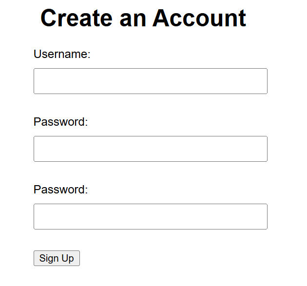
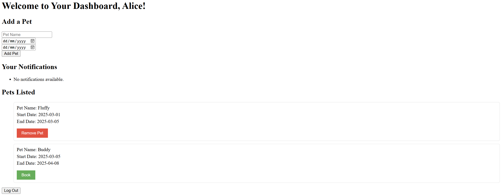

# PawPals

## Project Overview
PawPals is a web application that is used to match pet owners with pet sitters. The main aim is to create a network to let these 2 parties connect. The current version only allows for pet owners to list their pets, and for pet sitters to book the pets to take care of. Pet owners will then have to reach out to pet sitters beyond the platform to confirm the booking.

## Set Up
1. To set up, go to the GitHub repository [here](https://github.com/BunnyHoppp/PawPals).
2. `Clone` the repository onto your computer.
3. Run `./gradlew bootRun` to start the application.
4. Connect to your local machine using port 8080, by entering [http://localhost:8080](http://localhost:8080) in your browser.
5. The application is ready for you to use!

# Using PawPals
There are 2 pet owners and 2 pets listed on the application by default for testing purposes. 
- Username: Alice, Password: password1
- Username: Bob, Password: password2

1. User should click on `Sign Up` button to sign up for an account with their **username**, **phone number**, and **password**.

2. User will then be redirected to the login page where they should login with their **username** and **password**

3. User will be directed to the pet listings.
   - User can add a pet for listing
   - User can remove a listed pet that they added previously
   - User can book a listed pet
   - User can log out of their session when done

4. There is a notifications section where users will receive any bookings from pet sitters with their contact number.

## Features

### Listing a pet
- Users can list a pet by adding the start and end date that they want their pet to be taken care of.
- Users can remove their listed pet if they change their mind.
- Users can edit their listed pet by removing and adding a new pet.

### Booking a pet
- Users can book a pet by simply clicking the book button.
- Users who receive a booking will see it in the notifications and can contact the pet sitter through the number.

## Future Improvement

1. Database
   - The database is currently offline, hence it would not be possible to have an online application.
   - *Improvement*: This would be modified by using an online database, and a SQL database since there can be more structured queries.

2. Chatroom
   - The application does not support in-app messaging between the pet owner and pet sitter.
   - *Improvement*: The application can use Socket.io to have real time in app messaging for fast connections.

3. Reviews
   - The application does not have any reviews for the pet sitter.
   - *Improvement*: The application can add a review section to show previous pet owners' remarks on the pet sitter and to alert pet owners on any misconducts.

4. Payment
   - The application does not currently support in-app payments.
   - *Improvement*: The application can keep track of the hours and days of the pet being taken care of. For instance, the application can be alerted when the pet is picked up and when the pet is dropped off, and calculate a payment for the pet owner. All users can link a bank account for a seamless transaction.

5. Security
   - The sign up process is not secure at all and anyone can create an account.
   - *Improvement*: Users will have to verify their identify or have a confirmation email to ensure that there are less fraudulant accounts.
   - Passwords are stored directly.
   - *Improvement*: Passwords can be stored as a hash value of password and a random salt value, so that they will not be leaked by anyone who can see the data currently.

6. Image
   - The application does not support uploading of pictures, and these pictures can show pet sitters how cute the pets are or to show pet owners pictures of the pet sitter before they entrust the pet over to the pet sitters.
   - *Improvement*: Create a field for users to upload images when creating accounts and when creating a pet listing.